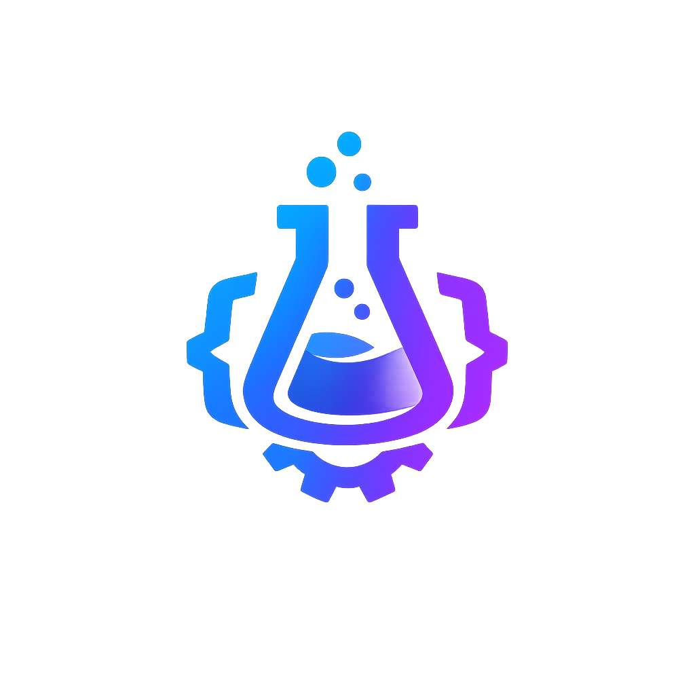

# SolveLab

### Aventuras e soluções, tudo em um só lugar

---

**Bem-vindo ao SolveLab!** 👋

Somos uma organização brasileira focada em desenvolvimento de servidores de jogos e projetos open source. Aqui a curiosidade vira código e compartilhamos tudo com a comunidade.

---

## 🎮 Servidores de Jogos

<table>
<tr>
<td align="center" width="50%">

### 🤠 RevoadaRP

**Plataforma:** RedM (Red Dead Redemption 2)

Servidor brasileiro de roleplay no Velho Oeste com sistemas avançados de crafting, economia dinâmica dirigida pelos jogadores e loop de PvE envolvente.

**Destaques:**
- 🔨 Crafting profundo com múltiplas tiers
- 💰 Mercado com preços flutuantes
- 🎯 Sistema completo de caça
- 🎙️ Voice chat integrado

</td>
<td align="center" width="50%">

### 🏎️ DriveZone

**Plataforma:** FiveM (GTA V)

Servidor brasileiro focado em corridas e veículos de alta performance com pistas customizadas e sistema de ranking.

**Destaques:**
- 🚗 Veículos exclusivos e customizáveis
- 🏁 Pistas criadas pela comunidade
- 🏆 Sistema de ranking competitivo
- 🔧 Tunning completo

</td>
</tr>
</table>

---

## 💻 Projetos Open Source

<table>
<tr>
<td width="50%">

### 👁️ Keeping an Eye on the Chat

App desktop Electron para streamers que exibe mensagens do chat Twitch com avatar animado e lip-sync.

**Tecnologias:** `Electron` `TypeScript` `GSAP`

</td>
<td width="50%">

### 🔍 Service Checker

Ferramenta Python de monitoramento que verifica status pages de terceiros e envia alertas configuráveis via Telegram ou Webhook.

**Tecnologias:** `Python` `Docker` `Telegram API`

</td>
</tr>
</table>

---

## 🛠️ O que fazemos

- 🎮 **Servidores de jogos** — FiveM, RedM com sistemas customizados
- 💻 **Projetos open-source** — Ferramentas e soluções para a comunidade
- 🖥️ **Interfaces (NUI)** — 18+ projetos React para interfaces in-game
- 📚 **Compartilhamento** — Tudo que criamos, compartilhamos
- 🎥 **Lives** — Desenvolvimento ao vivo

---

## 🔧 Stack Tecnológica

---

## 🤝 Filosofia

> *"Criamos por diversão e compartilhamos de graça."*

Todos os projetos aqui nascem da curiosidade e paixão por tecnologia. Acreditamos que o melhor código surge quando a diversão encontra o propósito.

---

## ☕ Apoie o Projeto

Nossos projetos são **100% gratuitos** e sempre serão. Se algo que criamos te ajudou e você quiser retribuir, considere pagar um café!

*Qualquer valor é bem-vindo e nos motiva a continuar criando!* 💙

---

**Explore nossos repositórios e sinta-se em casa!** 🏠

